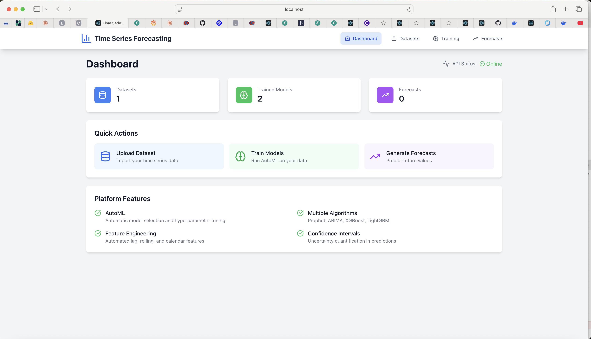

# 🚀 Time Series Forecasting Platform

An AI-powered time series forecasting platform with AutoML capabilities. Upload your data, automatically train and compare multiple forecasting models, and generate accurate predictions with confidence intervals.



## ✨ Features

- **📊 Dataset Management**: Upload CSV/Excel files, automatic data profiling
- **🤖 AutoML Training**: Automatic model selection and hyperparameter tuning
- **📈 Multiple Algorithms**: Prophet, ARIMA, XGBoost, LightGBM
- **🎯 Model Comparison**: Side-by-side performance metrics (MAPE, RMSE, MAE)
- **🔮 Forecast Generation**: Generate predictions with confidence intervals
- **📉 Interactive Visualizations**: Beautiful charts powered by Recharts
- **🐳 Docker Ready**: Easy deployment with Docker Compose

## 🏗️ Architecture
```
┌─────────────────────────────────────────────────────────────┐
│                    React Frontend                            │
│              (TypeScript + Tailwind CSS)                    │
└─────────────────────┬───────────────────────────────────────┘
                      │ REST API
┌─────────────────────▼───────────────────────────────────────┐
│                   FastAPI Backend                            │
│  ┌─────────────┐  ┌─────────────┐  ┌─────────────────────┐  │
│  │   Datasets  │  │   Training  │  │     Forecasting     │  │
│  │   Service   │  │   Service   │  │       Service       │  │
│  └─────────────┘  └─────────────┘  └─────────────────────┘  │
│  ┌─────────────────────────────────────────────────────────┐│
│  │                  AutoML Service (Optuna)                ││
│  │  ┌─────────┐ ┌─────────┐ ┌─────────┐ ┌─────────────┐   ││
│  │  │ Prophet │ │  ARIMA  │ │ XGBoost │ │  LightGBM   │   ││
│  │  └─────────┘ └─────────┘ └─────────┘ └─────────────┘   ││
│  └─────────────────────────────────────────────────────────┘│
└─────────────────────┬───────────────────────────────────────┘
                      │
┌─────────────────────▼───────────────────────────────────────┐
│                   SQLite Database                            │
│         (Datasets, Models, Forecasts metadata)              │
└─────────────────────────────────────────────────────────────┘
```

## 🚀 Quick Start

### Option 1: Docker (Recommended)
```bash
# Clone the repository
git clone https://github.com/yourusername/time-series-forecasting-platform.git
cd time-series-forecasting-platform

# Start with Docker Compose
docker-compose up -d

# Access the application
open http://localhost:8001
```

### Option 2: Local Development

#### Prerequisites
- Python 3.9+
- Node.js 18+
- npm or yarn

#### Backend Setup
```bash
# Create virtual environment
python -m venv venv
source venv/bin/activate  # On Windows: venv\Scripts\activate

# Install dependencies
cd backend
pip install -r requirements.txt

# Start the backend
uvicorn app.main:app --reload --host 0.0.0.0 --port 8001
```

#### Frontend Setup
```bash
# In a new terminal
cd frontend
npm install
npm start
```

Access the application at `http://localhost:3000`

## 📖 Usage Guide

### 1. Upload Dataset

Navigate to the **Datasets** page and upload your CSV file. The platform automatically detects:
- Date columns
- Numeric columns
- Data frequency

### 2. Train Models

Go to the **Training** page and:
1. Select your dataset
2. Specify the date and target columns
3. Choose algorithms to test (or select all)
4. Click "Start AutoML Training"

The platform will:
- Run hyperparameter optimization using Optuna
- Cross-validate each model
- Select the best performing model

### 3. Generate Forecasts

Navigate to the **Forecasts** page:
1. Select a trained model
2. Set forecast horizon (1-365 days)
3. Choose confidence level (90%, 95%, 99%)
4. Click "Generate Forecast"

## 📊 Supported Algorithms

| Algorithm | Type | Best For |
|-----------|------|----------|
| Prophet | Statistical | Seasonality, holidays, trend changes |
| ARIMA | Statistical | Stationary data, short-term forecasts |
| XGBoost | ML | Complex patterns, feature-rich data |
| LightGBM | ML | Large datasets, fast training |

## 🔧 Configuration

### Environment Variables
```bash
# Database
DATABASE_URL=sqlite:///data/timeseries.db
ASYNC_DATABASE_URL=sqlite+aiosqlite:///data/timeseries.db

# CORS
CORS_ORIGINS=http://localhost:3000,http://localhost:8001

# Logging
LOG_LEVEL=INFO
```

## 📁 Project Structure
```
time-series-forecasting-platform/
├── backend/
│   ├── app/
│   │   ├── api/v1/endpoints/    # API routes
│   │   ├── core/                # Config, database
│   │   ├── models/              # SQLAlchemy models
│   │   ├── schemas/             # Pydantic schemas
│   │   ├── services/            # Business logic
│   │   │   ├── automl/          # AutoML service
│   │   │   ├── forecasting/     # Model implementations
│   │   │   └── feature_engineering/
│   │   └── main.py
│   └── requirements.txt
├── frontend/
│   ├── src/
│   │   ├── pages/               # React pages
│   │   ├── services/            # API client
│   │   └── types/               # TypeScript types
│   └── package.json
├── data/
│   ├── uploads/                 # Uploaded datasets
│   ├── models/                  # Trained models
│   └── raw/                     # Sample data
├── docker-compose.yml
├── Dockerfile
└── README.md
```

## 🧪 API Documentation

Once running, access the interactive API docs at:
- Swagger UI: `http://localhost:8001/docs`
- ReDoc: `http://localhost:8001/redoc`

### Key Endpoints

| Method | Endpoint | Description |
|--------|----------|-------------|
| POST | `/api/v1/datasets/` | Upload dataset |
| GET | `/api/v1/datasets/` | List datasets |
| POST | `/api/v1/training/automl` | Start AutoML |
| GET | `/api/v1/training/models` | List models |
| POST | `/api/v1/forecast/` | Generate forecast |

## 📈 Performance Metrics

The platform evaluates models using:

- **MAPE** (Mean Absolute Percentage Error) - Primary metric
- **RMSE** (Root Mean Square Error)
- **MAE** (Mean Absolute Error)
- **R²** (Coefficient of Determination)

## 🛠️ Tech Stack

### Backend
- **FastAPI** - Modern Python web framework
- **SQLAlchemy** - ORM with async support
- **Optuna** - Hyperparameter optimization
- **Prophet** - Facebook's forecasting library
- **XGBoost/LightGBM** - Gradient boosting
- **statsmodels** - ARIMA implementation

### Frontend
- **React 18** - UI framework
- **TypeScript** - Type safety
- **Tailwind CSS** - Styling
- **Recharts** - Data visualization
- **Axios** - HTTP client

## 🤝 Contributing

Contributions are welcome! Please feel free to submit a Pull Request.

1. Fork the repository
2. Create your feature branch (`git checkout -b feature/AmazingFeature`)
3. Commit your changes (`git commit -m 'Add some AmazingFeature'`)
4. Push to the branch (`git push origin feature/AmazingFeature`)
5. Open a Pull Request

## 📄 License

This project is licensed under the MIT License - see the [LICENSE](LICENSE) file for details.

## 👤 Author

**Olawale Badekale**
- GitHub: [@yourusername](https://github.com/yourusername)
- LinkedIn: [Your LinkedIn](https://linkedin.com/in/yourprofile)

## 🙏 Acknowledgments

- [Prophet](https://facebook.github.io/prophet/) by Meta
- [Optuna](https://optuna.org/) for hyperparameter optimization
- [FastAPI](https://fastapi.tiangolo.com/) for the excellent framework
